# The Baking Book 
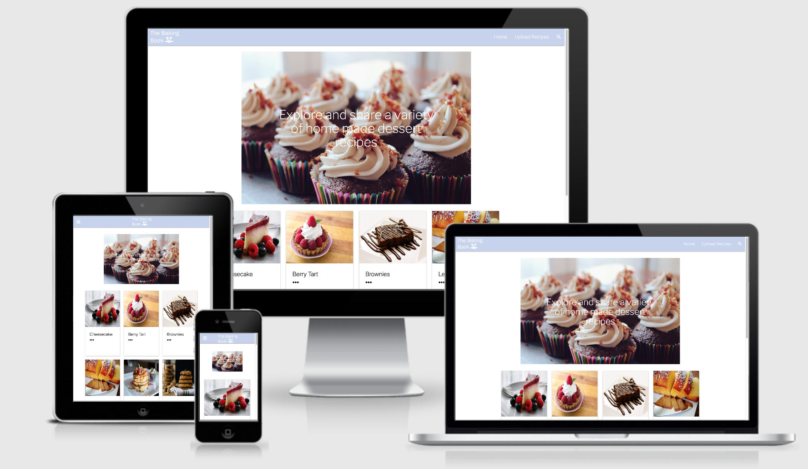

[The Baking Book](https://the-baking-book.herokuapp.com/index) is a user friendly, home made dessert recipe website. Users can manipulate the platform and data to view, upload, modify and delete recipes of their choice. The website is straight forward and easy for the user to navigate around. 

Recipes are presented in the form of cards which display on the home page. From here, a user can gain quick access to brief information via clicking on the three dots provided. There is also an option to [view more](https://the-baking-book.herokuapp.com/view_more/5f9b12db20f341c17f6f6882), which will take the user to a full description of the recipe, including recipe name, image, preparation time, baking time, how many people it serves, ingredients and the method.

# Table of contents
* [UX Design](#UX-Design)
* [Project Development](#Project-Development)
* [Features](#Features)
* [Technologies Used](#Technologies-Used)
* [Testing](#Testing) 
* [Deployment](#Deployment)
* [Credits](#Credits)
 

# UX Design

**Strategy**

The reason for building [The Baking Book](https://the-baking-book.herokuapp.com/index) is to allow users to gain quick access to dessert recipes. This website would be useful for experienced and in-experienced bakers looking for easy to follow recipes to make in the comfort of their own home. Through using [CRUD](https://en.wikipedia.org/wiki/Create,_read,_update_and_delete) functionality, users can create, read, update and delete recipes on the website. There is also a search feature which allows users to search a [MongoDB](https://www.mongodb.com/) created index of recipe names, description and ingredients. 

To ensure I could properly fulfil the users' needs and objectives, I asked three individuals to provide me with real-life user situations about a recipe website which may aide me in ensuring I was targeting the right features and ideas.

User stories 

1. User 1:

*I would like to access a recipes ingredient information so I know what I would need to buy before baking.*

2. User 2:

*I have previously uploaded a recipe to The Baking Book; however, I have developed on the recipe and would like to update it on the website.*

3. User 3:

*I would like to specifically search for recipes that include chocolate in their ingredients.*

**Scope**

Due to my strategic goals, it is important to give users control to create, read, update and delete recipe data on the website. Therefore, it is essential that users can easily access this information and can manipulate the data accordingly. The requirements for this application are:
* Provide a selection of recipe cards which will include recipe images, recipe name, icons for preparation time, baking time and the amount of people it serves, along with a brief description.
* Links to full description pages from the cards will then provide the option to read, update and delete that specific recipe. 
* A separate page will be presented for users to upload their own recipes which will require a combination of text and image URLs.
* A search feature displayed in the navigation menu will permit users to filter through the website searching for specific recipes or ingredients. 
* Links to social media platforms [Facebook](https://www.facebook.com/), [Pinterest](https://www.pinterest.co.uk/) and [Instagram](https://www.instagram.com/) will be displayed in the footer.
* A mobile navigation menu will aim to maintain the applications responsiveness on smaller viewports. 

**Structure** 

Given the functional requirements of this application, the interaction design of this website means that users can effectively accomplish their goals for engaging with the website. However, to ensure the interaction design is well thought out and works in practice, through using [Flask](https://en.wikipedia.org/wiki/Flask_(web_framework)) Flash messages, users will be informed of changes they've made to recipes. Once a user has interacted with the website for example, uploaded a recipe or deleted one, they will then be redirected to an appropriate page to carry on with their journey through the website. 

It is imperative that the information architecture is appropriately displayed across the website. To avoid the issue of presenting too much content on a page and deterring the user from continuing, keeping the information relative and prioritising sections based on user interactions and needs will be most effective. For this reason, a user will only be able to gain access to a full recipes description once clicking on the view more option from the [index](https://the-baking-book.herokuapp.com/index) recipe cards. From there, they can read, update and delete selected recipe. This will avoid presenting users with a list of full recipe descriptions which could prove to be an overload of information. The navigation menu will consist of the [home](https://the-baking-book.herokuapp.com/index) page, [upload a recipe](https://the-baking-book.herokuapp.com/add_recipes) and the [search](https://the-baking-book.herokuapp.com/search) feature. Ensuring to keep the movement around the application simple for the user.   

**Skeleton**

Initially, I had designed the website to include further features such as a user's personal account where they would be able to login and have access to their favourite recipes. I had also designed the application to include a star rating system, based on user experiences with the recipes. However, after discussing this with my Mentor, Aaron Sinnott, during my first project interpretation mentor session, we had decided to deter away from those features to be able to solely focus on the criteria at hand. Below is a screen grab of how my [wireframes](https://en.wikipedia.org/wiki/Wireframe) had initially been designed. 

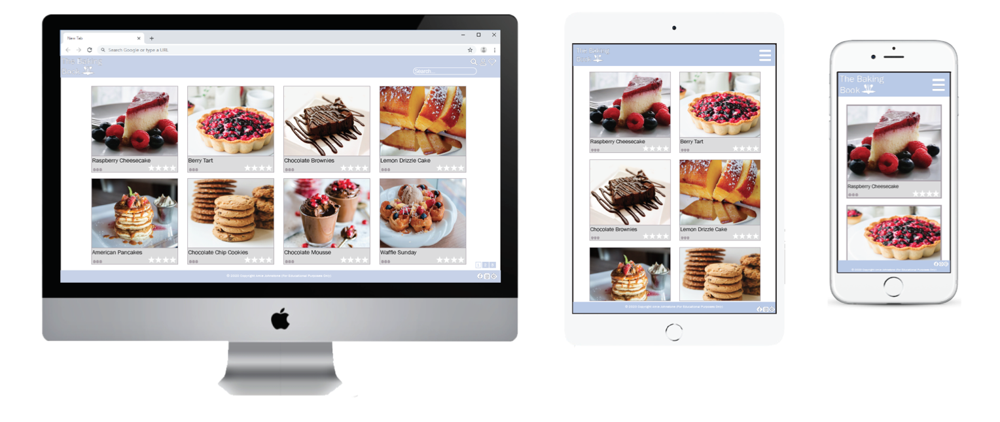

After the discussion with Aaron, I had modified the wireframes to ensure the remaining interaction design, information architecture, navigation and features could contine to be displayed appropriately to allow the user to interact with the functionality of the website effectively. This also meant rethinking the interface design of re-direct page links and the navigation design. 

*** Insert new wireframes ***

All wireframes were created using [Adobe InDesign](https://www.adobe.com/uk/products/indesign.html) and can all be accessed from the wireframes document [here](docs/wireframes). 

**Surface** 

The website will use the [Materialize](https://materializecss.com/) Library for components such as the [cards](https://materializecss.com/cards.html), [buttons](https://materializecss.com/buttons.html), [navigation](https://materializecss.com/navbar.html) and [footer,](https://materializecss.com/footer.html) as well as the [text input](https://materializecss.com/text-inputs.html) form to allow users to upload and update a recipe. 

Due to the number of recipe images that will be displayed, I thought it best to keep the colour scheme simple using #c6d2ed for the navigation and footer menu's along with various buttons that are used. Throughout the website, that along with #dcdcdc will be used to ensure the website is visually pleasing and maintains consistency. Using black and white border colours will ensure the user is aware of the feature displayed and whether to interact with it or not. 

The typography will be taken from [Google Fonts](https://fonts.google.com/) and styled as ['Libre Franklin', sans-serif.](https://fonts.google.com/specimen/Libre+Franklin?query=Libre+Franklin) I felt this was a good option as it is easy to absorb and well suited the design of the website. 

# Project Development 

**MongoDB**

The database I used for this project was hosted through [MongoDB Atlas](https://www.mongodb.com/). Below is an example of my collection:
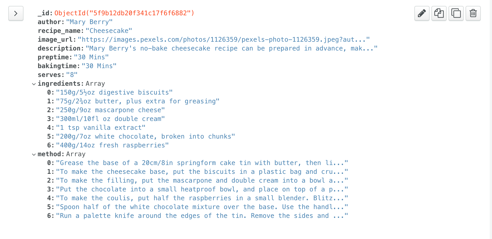

**Trello Board**

During the development of building this website I had created a [Trello Board](https://trello.com/en) which supported me in keeping to daily targets and prioritising more challenging tasks. Below is a screen grab of how the board looked at one point during the development. 

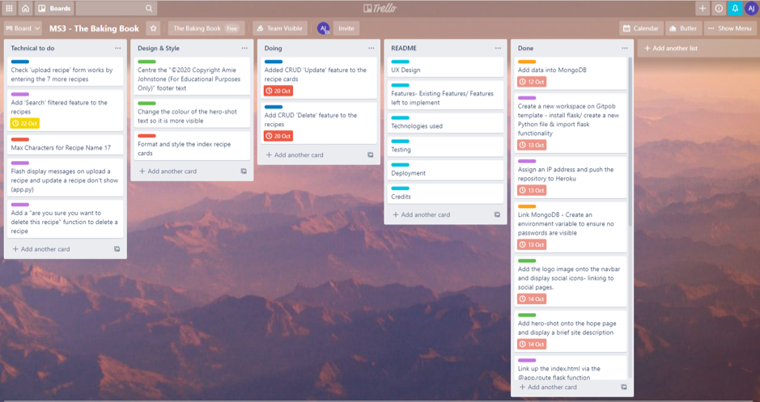

**Code Structure**

As the project grew in scale, I decided to split the structure of the code to make it more manageable. Below is a demonstration of my file structure:

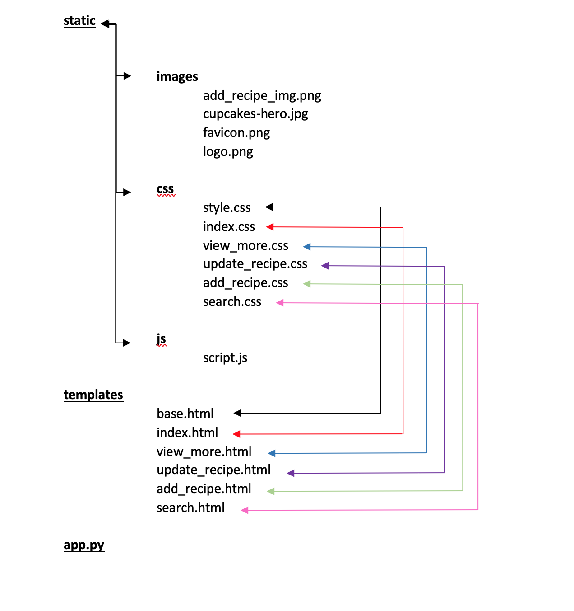

# Features 

**Existing Features**
 
* Navigation Menu-

The navigation menu provides links to the [home](https://the-baking-book.herokuapp.com/index) page, [upload recipes](https://the-baking-book.herokuapp.com/add_recipes) and [search](https://the-baking-book.herokuapp.com/search) feature. There is a hover over this, so the user is aware of what they are selecting when browsing the options. The logo featured in the far-left corner takes the user back to the home page once clicked. 

* Mobile Navigation Menu-

When viewing the website on a smaller mobile device, the navigation menu will switch to a mobile responsive nav, once selected it will provide the users with options to visit the home page, upload a recipe or search. 

* Recipe Cards-

Recipe cards display on the [index](https://the-baking-book.herokuapp.com/index) page to provide a brief overview of the recipes. 

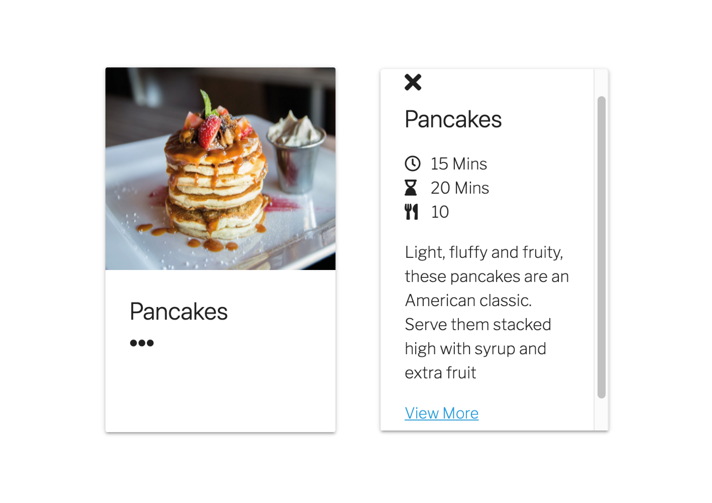

* Footer- 

The footer provides social links to [Facebook](https://www.facebook.com/), [Pinterest](https://www.pinterest.co.uk/) and [Instagram](https://www.instagram.com/). These are all accessible on every page. 

* Recipe View-

Once clicked on a recipe card and selected 'view more', the user is presented with that recipe's full data on a separate page.

* Delete Recipe-

If a user decides to delete a recipe from the view more page, they can do so by clicking on the 'delete' button.

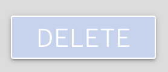

* Update Recipe Button -
 
 The update button will take the user to update the recipe.

* Update Recipe-

From the view more recipe page, the user has an option to update the recipe which takes them to a page ready for editing the current information. 

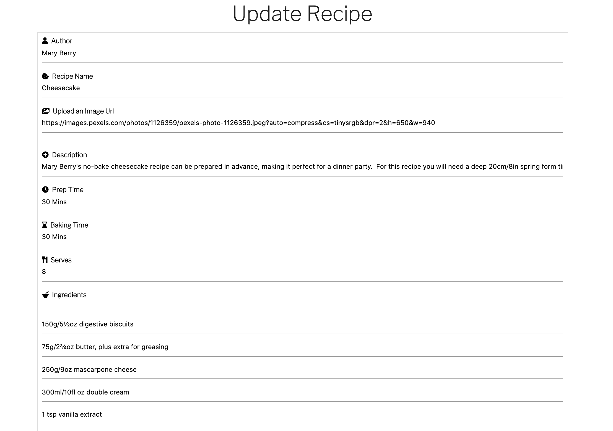

* Upload Recipe-

From the navigation menu a user can click to upload a recipe, they will be brought to the below image where they will be required to fill in the information.

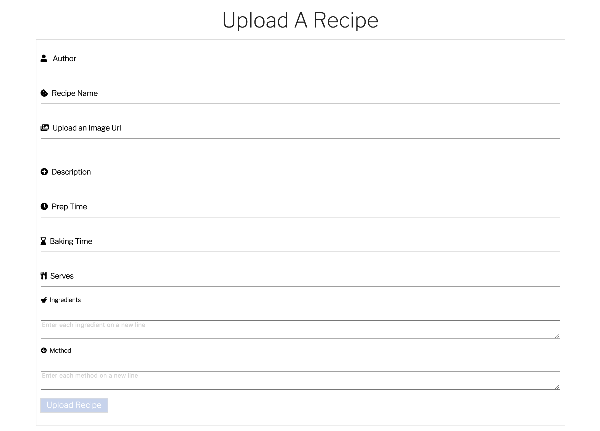

Search-
The [search](https://the-baking-book.herokuapp.com/search) feature will provide the option to search for something specific or reset the search if required. If a search is successful it will pull up all relevant recipes in the form of cards. 

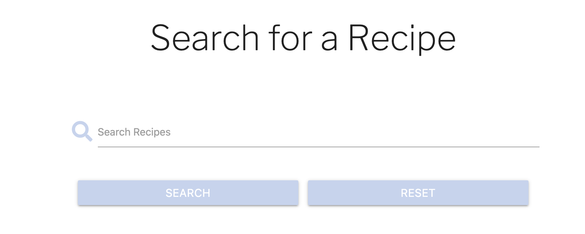
  
**Features left to implement**

Although I couldn't include all features from the original wireframes, there is some that I would like to implement in the future. 
* A user account- login/ sign up option- where the user can store saved recipes and only have access to modify or delete recipes they have uploaded onto the site. 
* An option to allow the users to star rate the recipes, concluding in a recipe general rating. 
* As the website grows and the recipes continue to be uploaded, add pagination to the index page to allow for users to click through pages rather then scroll through a cluster of recipes.
* A user chat- where account users can openly discuss and share thoughts about recipes they have or plan to make, for tips and tricks. 
* A recipe delete confirmation button.
* No search results message.

# Technologies Used 
Below is a list of technologies that contributed to the final product:
* [Flask](https://en.wikipedia.org/wiki/Flask_(web_framework)) - Used as the main framework for my application
* [Python](https://en.wikipedia.org/wiki/Python_(programming_language))  - Used for backend data manipulation
* [Jinja2](https://en.wikipedia.org/wiki/Jinja_(template_engine))  - Used as the main templating language for template manipulation
* [HTML5](https://en.wikipedia.org/wiki/HTML5) - Used as the main language for the templates
* [CSS3](https://en.wikipedia.org/wiki/CSS) - Used for styling the webpage
* [JavaScript](https://en.wikipedia.org/wiki/JavaScript) - Used for some front-end functionality
* [Git](https://en.wikipedia.org/wiki/Git) - Used for version control
* [Materialize](https://materializecss.com/about.html) - Used as the main frontend framework
* [Google fonts](https://fonts.google.com/) - Used for website fonts
* [Font Awesome](https://fontawesome.com/) - Used for some icons on the website
* [Heroku](https://signup.heroku.com/?c=70130000000NeLCAA0&gclid=CjwKCAjw8-78BRA0EiwAFUw8LMUicsvP3MRHbgLTMYWypfJKww_Dn6LMCr6W5nd-vD2s3EZNkeKofRoCTMoQAvD_BwE) - Used to host the website
* [GitHub](https://en.wikipedia.org/wiki/GitHub) - Used to store my project source code
* [MongoDB](https://www.mongodb.com/) - Used as the main database technology

**Other Tools:**

* [Adobe InDesign](https://www.adobe.com/uk/products/indesign.html) - Used to create the wireframes.
* [Adobe illustrator](https://www.adobe.com/products/illustrator.html) - Used to create the logo 
* [Grammarly](https://app.grammarly.com/?network=g&utm_source=google&matchtype=e&gclid=CjwKCAjw8-78BRA0EiwAFUw8LIwcbehXurVlxps-tDqCAu2YBHX5qwkcWslavRa1XJX3f9_zT3a-fRoC4xQQAvD_BwE&placement=&q=brand&utm_content=329885936576&gclsrc=aw.ds&utm_campaign=brand_f1&utm_medium=cpc&utm_term=grammarly) - Used to double-check all my spelling and grammar.
* [W3C Markup](https://validator.w3.org/) - Used this to check my HTML for errors and typos.
* [W3C CSS](https://jigsaw.w3.org/css-validator/) - Used this to check the validity of my CSS.

# Testing

**Browser and Device Testing-**

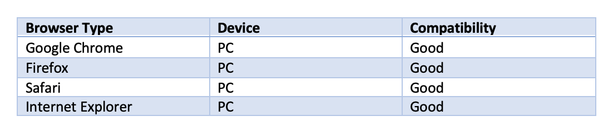

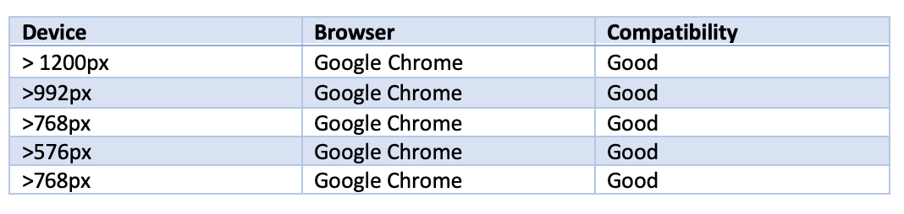

The following features were tested in the browser and device testing:

- [x] Navigation links 
- [x] Recipe cards reveal further information
- [x] View more link redirects to the correct page 
- [x] Information is neatly displayed 
- [x] Update recipe redirects to update form
- [x] Update recipe form allows information to be modified and saved 
- [x] Cancel update recipe restores the original information 
- [x] Delete recipe button erases recipe from the website
- [x] Upload recipe- specified characters required 
- [x] Upload recipe button- redirects user to home page where the new card is played  
- [x] Search feature provides correct results in recipe card format
- [x] Flash messages appear when called
- [x] Mobile navigation menu works as expected 
- [x] Footer social media links redirect to the correct URL in a separate browser window

**User Testing-**

Whilst testing for this project, I had gone back to my original user stories and asked the individuals if they could complete their initial queries.

User stories-

1. User 1:

*I would like to access a recipes ingredient information so I know what I would need to buy before making.*

- "From clicking on the relevant recipe on the home page, I was able to easily view its ingredients by clicking on the view more option. This took me to the full description where I was provided with the relevant information."

2. User 2:

*I have previously uploaded a recipe to The Baking Book; however, I have developed on the recipe and would like to update it on the website.*

- "After uploading a recipe to the website, I was able to modify it by clicking to view more about the recipe from its home card and then clicking on the update button. From here, I added more information and clicked on the upload recipe button."

3. User 3:

*I would like to specifically search for recipes that include chocolate in their ingredients.*

- "On the home page I clicked on the search icon. This brought me to the search page where I typed in the word chocolate and selected 'search'. All of the recipes that contained this ingredient were pulled up on the page available for me to click on a gain more information about each."

**Documented Issues:**

* Recipe cards

I had come across an issue quite late in my development. I tested my 'recipe upload' by entering 8 recipes that displayed as cards on the index page. These all worked fine and with the format in place I could begin styling. However, my recipe cards started to disappear which left me checking my code for bugs. Nothing could be found wrong in the code, so I went to the next source and checked my MongoDB collections. The data had also been removed from my MongoDB. After researching why this may be and checking in with tutor support, it was apparent that someone had been onto my website and hence deleted the recipes one by one. To avoid this happening again moving forward, I was advised to toggle off my dyno formation in Heroku until the project was ready to be submitted. Although, I was warned by my Tutors to expect this to happen again. If this is the case post submission, the website is still functional by uploading recipes. From there, they can be read updated and deleted by the user. 

* Search Results

I encountered some issues when initially putting in the search feature. After creating the @app.route and search form, I proceeded to copy in the Materialise card format from the index. However, there was an issue when trying to get onto the search page itself. Due to the fact at this point I hadn't created the if else statement, it was presenting a Jinja error. This was resolved after a few attempts and commits. The reason for these commits is because the page itself worked, due to the fact I was already on the search page and it was filtering results perfectly fine, it was only after leaving the search page that I had noticed the page could not be re-accessed. 

# Deployment 
The repository for this project is hosted through [GitHub Pages](https://pages.github.com/) and is deployed live through [Heroku](https://signup.heroku.com/?c=70130000000NeLCAA0&gclid=CjwKCAjw8-78BRA0EiwAFUw8LDd1jQhifJcDNzVQbxeHH4bGiP88aGiFSXaahAjSa1jyD4DSCPFtiRoCr3sQAvD_BwE). 

The deployment process of this project consisted of:

Before I created my Heroku application, I had to tell Heroku which applications and dependencies were required to run the app. I typed `pip3 freeze –local > requirements.txt` into my GitPub terminal to create the requirements.txt file. The Procfile is what Heroku looks for to know which file runs the app and how to run it. I achieved this by typing `echo web: python app.py > Procfile` into the terminal to create the Procfile. I checked they were both created successfully in the fire directory and ensured all decencies that are required for flask are listed in the requirements.txt file.

In Heroku, once logged on I clicked create a new app. I typed in my app name and selected the region closest to me. Selected Create app. In order to connect the app, I set up automatic deployment from my GitHub repository. I made sure this was displayed then added my repository name, clicked search, once it found the right repository, I clicked to connect to this app. 

Before I was able to enable automatic deployment, since I had contained my environment variables within the hidden app.py file, Heroku won’t be able to read those variables. I clicked on the settings tab for the app and then clicked on reveal config Vars. I made sure not to include any quotes for the key or value. The first variable is IP with the value of 0.0.0.0. Next the port which is 5000. For the secret key, I copied that from the env.py file and pasted it into Heroku. The MongoDB name is the name of my database. I went back to the deploy tab, but before I could push it, I needed to push my two new files to the repository. Once done, I could now safely proceed with automatic deployment on Heroku. I clicked deploy branch.  It showed a message informing me my app was successfully deployed, I clicked view to launch my new app.

Should you wish to access the URL to the website, that can be found via: 
https://the-baking-book.herokuapp.com/index

# Credits 

## Content
The content for dessert recipes were taken from various cooking websites such as:
* [BBC good food](https://www.bbcgoodfood.com/) 
* [Simply Recipes](https://www.simplyrecipes.com/)

## Media
All dessert images were used from:
* [Pexels.](https://www.pexels.com/) 
* [Pixabay.](https://pixabay.com/)

**Icons**

All icons were used from:
* [Font Awesome](https://fontawesome.com/) icon library.
* [Materialize](https://materializecss.com/icons.html) Icons.

## Acknowledgements

The Baking Book was inspired by:
* [BBC good food](https://www.bbcgoodfood.com/) 

Channels such as [slack](https://slack.com/intl/en-gb/) and [Stack Overflow](https://stackoverflow.com/) assisted in some technical challenges.

I would like to thank my Mentor Aaron Sinnott for his advice and guidance throughout the development of this project. 
